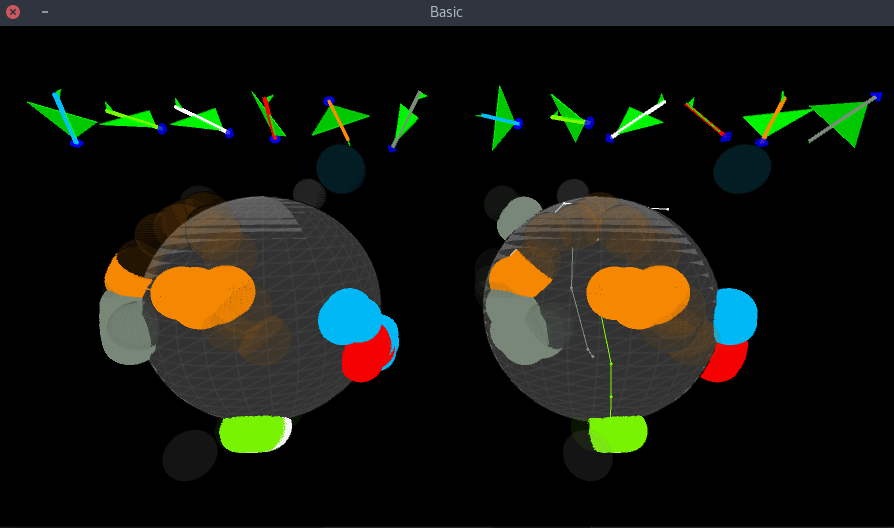
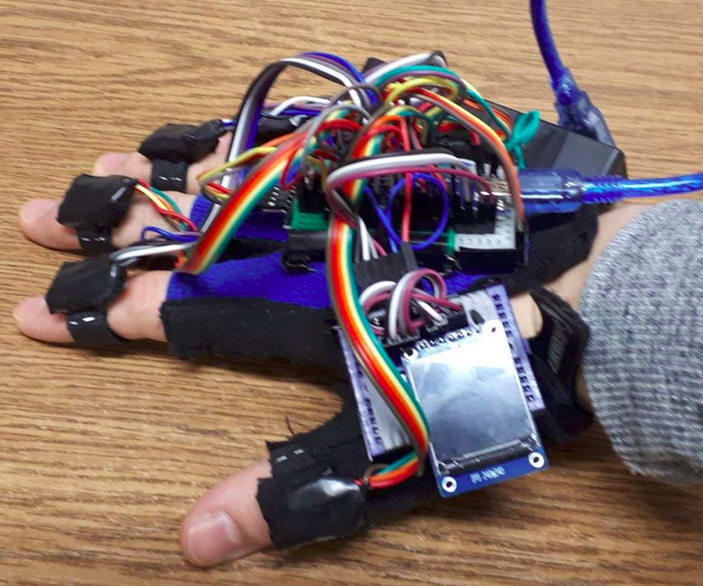

# GAG

Gyroscope-Accelerometer Glove

## Everything in progress ..

# Tested HW

Arduino nano
- https://www.aliexpress.com/item/Nano-V3-0-3-0-Mini-USB-Driver-ATmega328-ATmega328P-5V-16M-Micro-Controller-Board-CH340/32865670542.html

MPU6050
- https://www.aliexpress.com/item/MPU-6050-3-Axis-gyroscope-acce-lerometer-module-3V-5V-compatible-For-Arduino/2035920870.html

Bluetooth module HC-06
https://www.aliexpress.com/item/Freeshipping-HC-06-Wireless-Bluetooth-Module-With-baseboard-Slave-Wireless-Serial-Port-for-arduino-with-Dupont/1568545615.html
- setup with commands - http://www.martyncurrey.com/arduino-and-hc-06-zs-040/#AT%20Commands

### Ouput format of report data line

```
<HH:mm:ss.SSS> <finger> <q0> <q1> <q2> <q3> <a0> <a1> <a2>
```

## Eclipse IDE

[Setup](https://processing.org/tutorials/eclipse/)

Libraries:
```
~IDE/processing-3.4-linux64/processing-3.4/core/library/core.jar
~gicentreUtils/gicentreUtils/library/gicentreUtils.jar
~sketchbook/libraries/toxiclibs/library/toxiclibs.jar
~IDE/processing-3.4-linux64/processing-3.4/modes/java/libraries/serial/library/serial.jar
~IDE/processing-3.4-linux64/processing-3.4/modes/java/libraries/serial/library/jssc.jar
~IDE/processing-3.4-linux64/processing-3.4/lib
~IDE/processing-3.4-linux64/processing-3.4/core/library/jogl-all.jar
~IDE/processing-3.4-linux64/processing-3.4/core/library/gluegen-rt.jar
```

And some other...

#### Issues with libraries

If ```java.lang.UnsatisfiedLinkError: jssc.SerialNativeInterface.openPort(Ljava/lang/String;Z)J``` will appear use follow [this](https://stackoverflow.com/questions/40696417/java-simple-serial-connector-trows-exception-unsatisfiedlinkerror) stackoverflow solution downloading latest [JSSC library](https://code.google.com/archive/p/java-simple-serial-connector/downloads) clicking  [here](https://storage.googleapis.com/google-code-archive-downloads/v2/code.google.com/java-simple-serial-connector/jSSC-2.7.0-Release.zip) extracting it and using ```~/jSSC-2.7.0-Release/jssc.jar```


## Issues

[Linux failing Bluetooth connection](https://dev-pages.info/ubuntu-bluetooth/)


## Tutorials
[BT serial](https://unix.stackexchange.com/questions/92255/how-do-i-connect-and-send-data-to-a-bluetooth-serial-port-on-linux)

### BT commands
[MLT-BT05-AT](http://denethor.wlu.ca/arduino/MLT-[better one](BT05-AT-commands-TRANSLATED.pdf)

https://img.banggood.com/file/products/20150104013200BLE-CC41-A_AT%20Command.pdf)

#### TODO

- Convert 2 bytes of gyro (and/or accel) data to 1 byte with log or similar compression -> should be faster
- speed it up (especially HW)
- handle bidirectional commands and data from pc to right and/or left hand (to use display over spi/i2c, etc.)
- add 1 MPU9650 per hand/wrist..
- try use esp32 (for 1 hand could solve AltSoftSerial baud limit issue and other issues), teensy, arduino mega 2560 pro mini, different BT modules, etc.
- use display for some visualization
- minimalize HW - printed circuits..
- gesture recording & recognition (also mouse & keyboard?)
- data transfer security issues
- add documentation
- refactore everything - code, documentation
- create platform?
- add mobile support (Android using processing app?)
- make native - Java -> C (also because of performance)
- add VR/AR support
- pipeline, tests - UI, HW, etc.
- API, extendable modules, etc.
- user experience - walkthroughs, etc.
- HW feedback - micro flat vibration motor

## Eclipse

How to increase RAM? When running java program use Program/VM arguments:
```
-Xms512m -Xmx4096m
```

# Illustrative images



