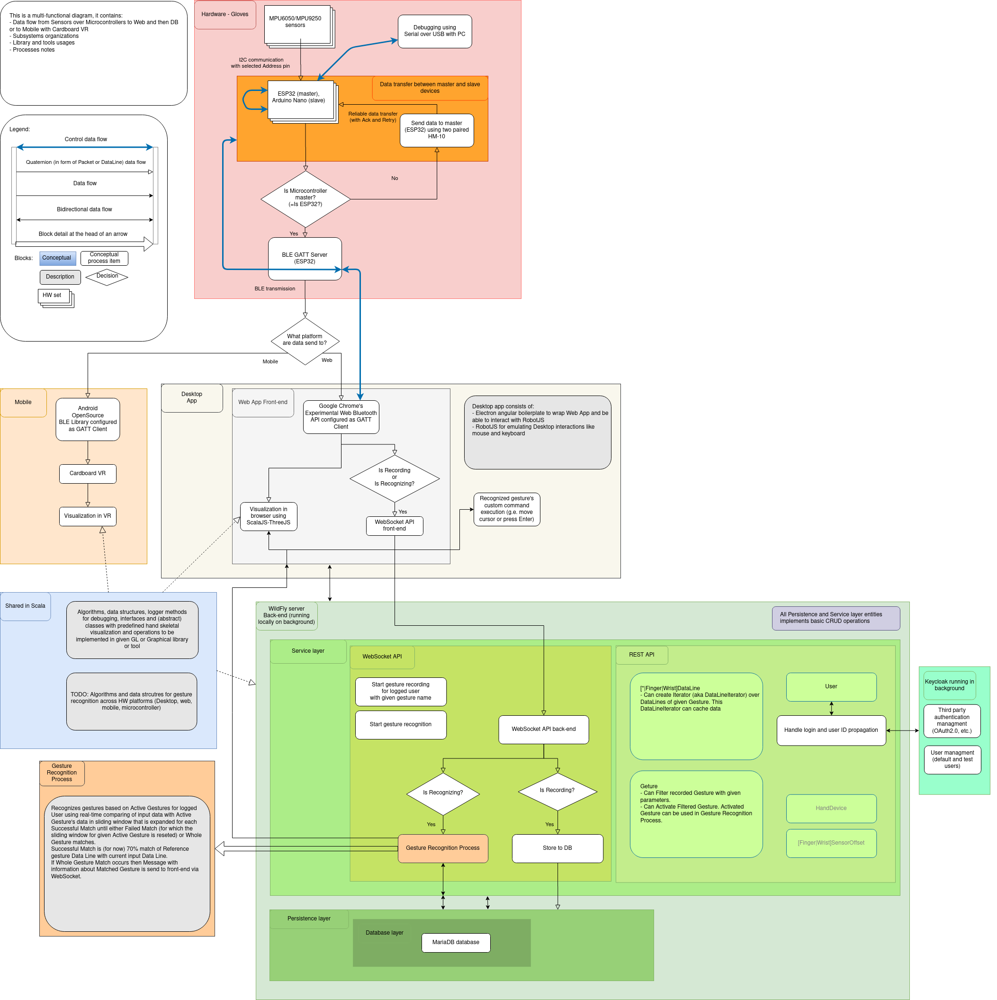
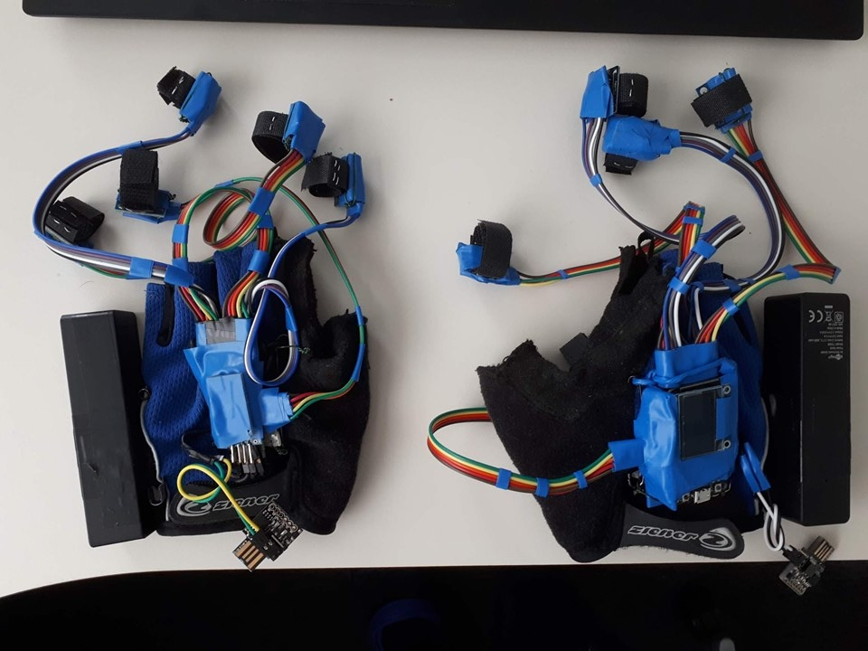
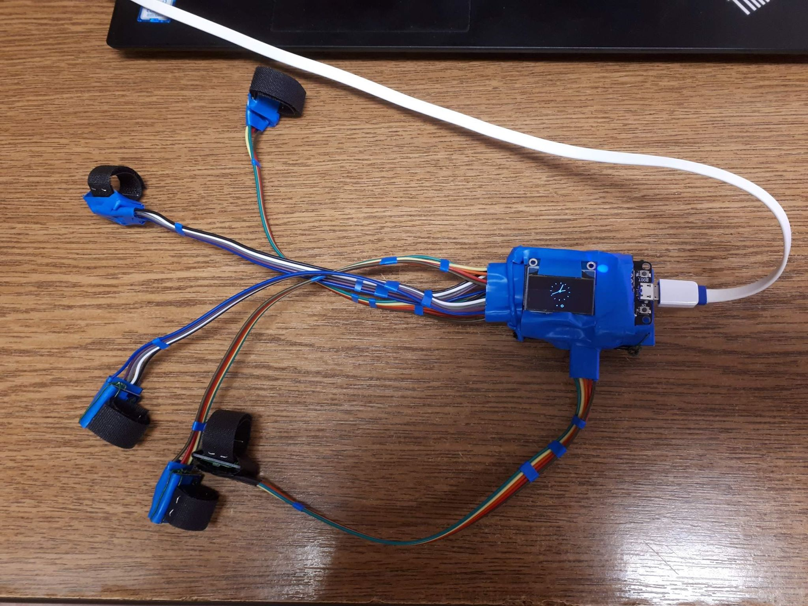
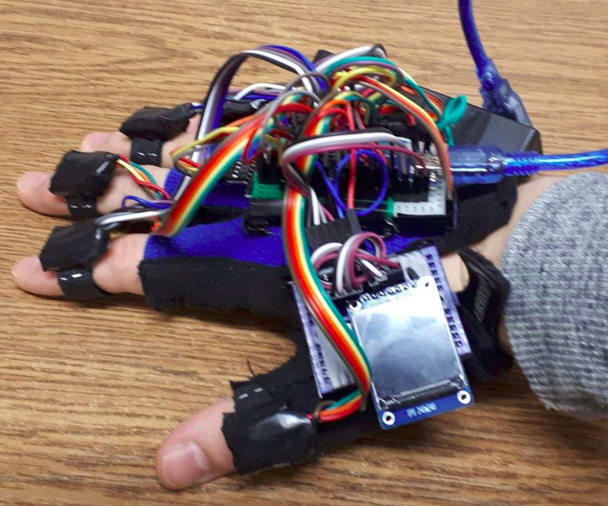
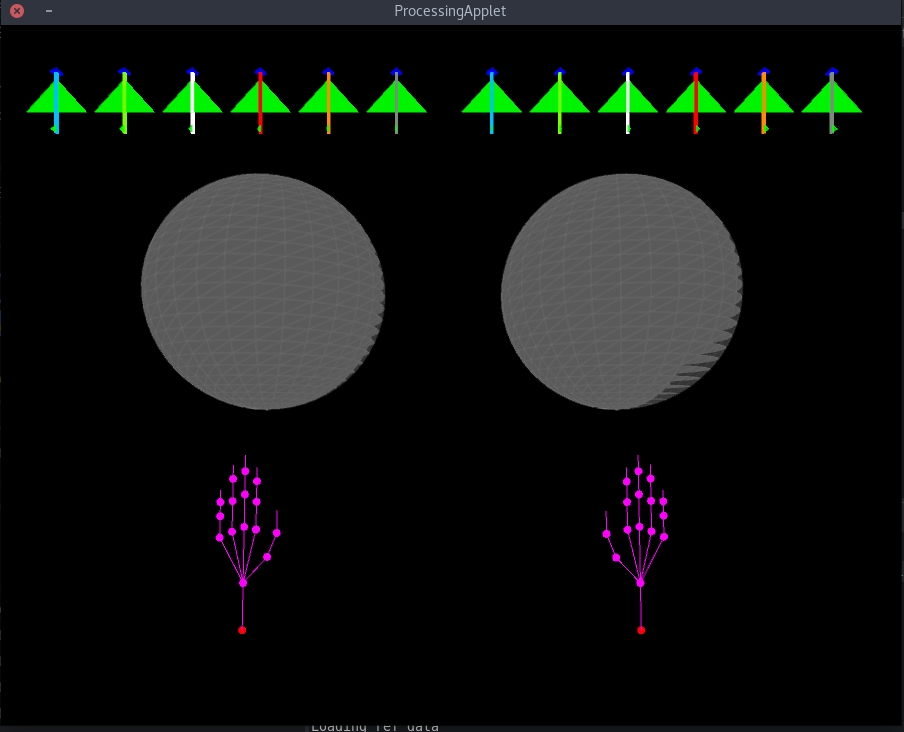

# (Gyro-Accelerometric|Gestures Automation) Glove

## ... in short "GAG"

## Goal

Gestrue Automation Glove
- mouse
- VR interface

## Everything in progress ..

### HW

- [x] HW prototype #1 #2 #3
- [x] #1 Arduino Nano, #2 Arduino ProMini
- [x] #2 ESP32
- [x] #2 display (SSD1306)
- [x] wireless communication over BT modules (BLE04?), etc.
- [x] create performance friendly protocol for communication between devices
- [ ] fix sensors offsets
- [ ] ...

### SW

- [x] basic visualization
- [x] basic web app sketch
- [x] POC of gesture recognition
- [x] TODO web app..
- [x] using WebUSB or similar...  
- [x] configurable gesture recognition
- [x] User Experience (in progress in web app)
- [ ] Code refactoring (3+ times)

Multifunctinal diagram with notes

[latest version](https://drive.google.com/file/d/1gAnSopoRvAL5JQSFl59_ViQZIJ3lHGMG/view)

More specific info can be found in team [trello]( https://trello.com/b/3HKvK85J/gag)

Some basic [setup notes](./data/docu/setupInfo.md)

### Sales notes

Wanna buy? Use [patreon](https://www.patreon.com/gesture_automation_glove) or contact me <prusa.vojtech@gmail.com>

### Issues

Please use Issues
